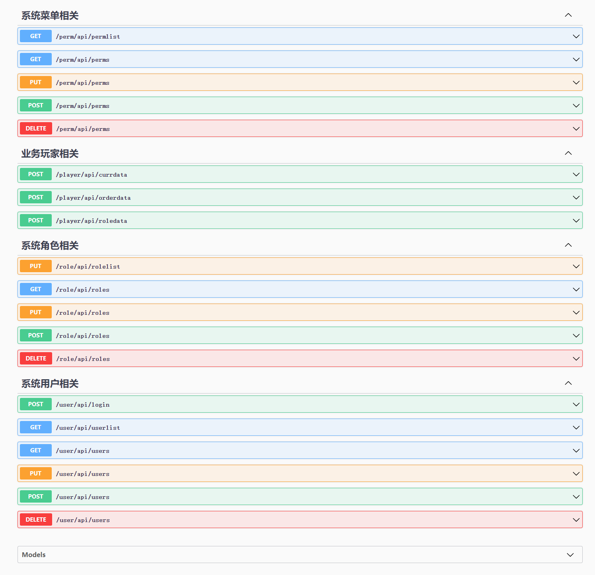
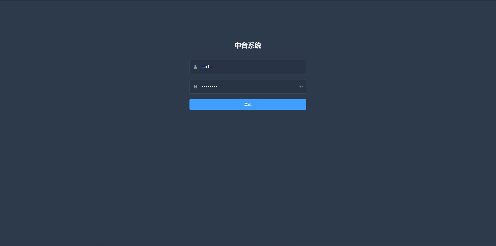
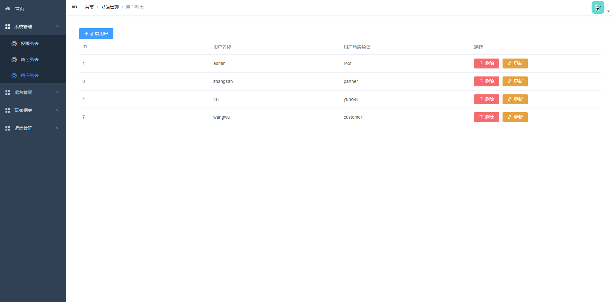
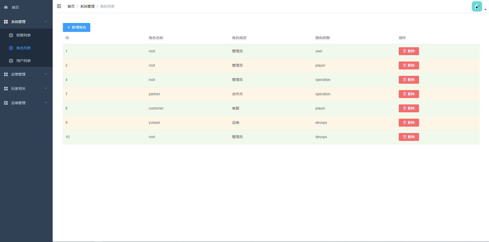
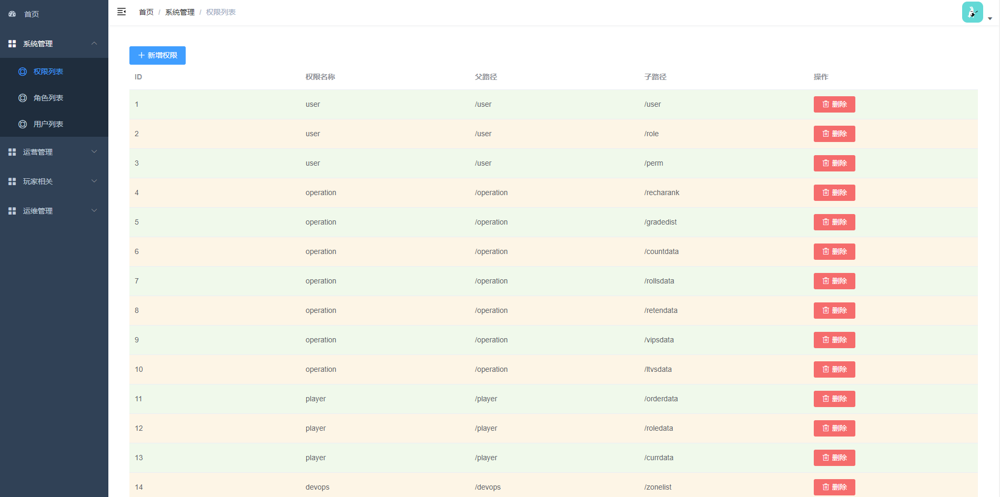
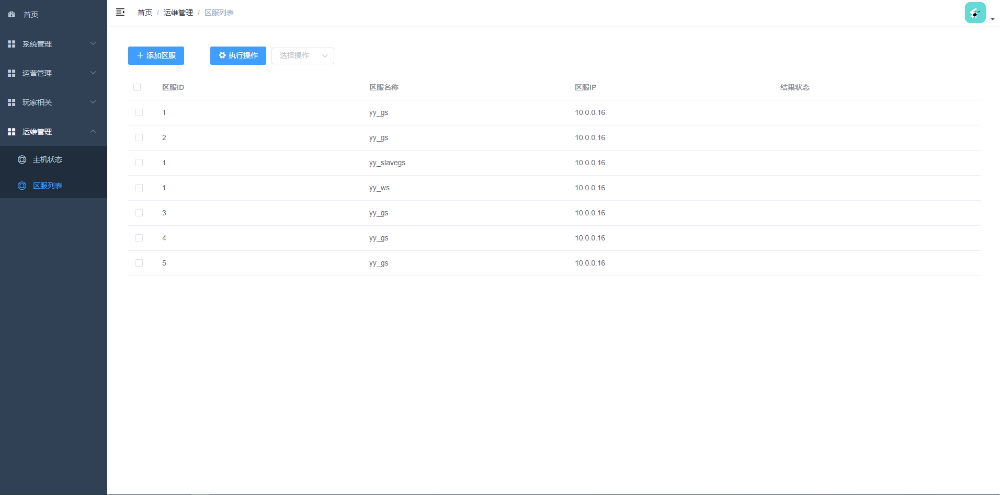
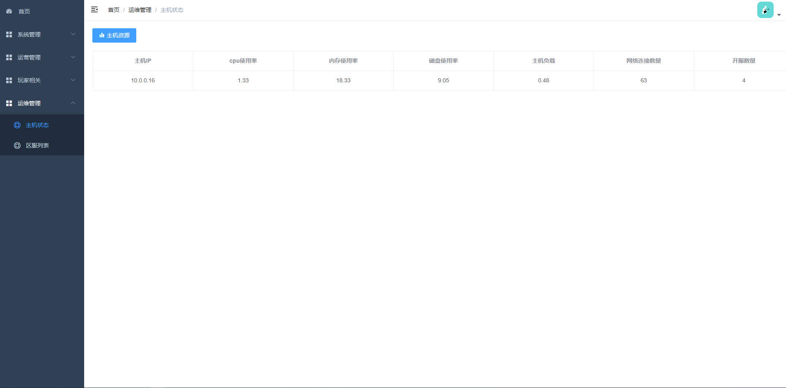
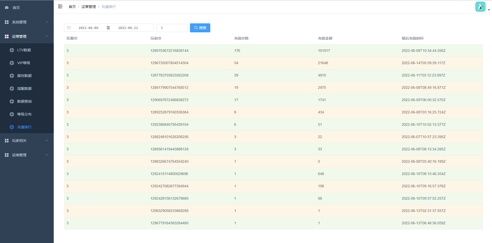

#### bnzt

* 由于该项目公司在用,源码不方便开放.

```
  bnzt是一个gin和vue-admin-template框架写的游戏中台系统,主要功能:
    - 基于角色的页面级权限管理
    - 运营相关的数据查询(基于es)
    - 游戏内玩家相关的数据查询(基于es)
    - 运维管理,游戏区服添加,版本更新,启停服,状态检查等(基于rpcx包的server&&client架构)

  游戏主机依赖环境：
    - yum install sshpass svn rsync
    - mkdir -p /data/game
    - 使用指定的用户名启动

```


* **展示图**
* 
* 
* 
* 
* 
* 
* 
* 
* **gin-swagger**
  * *step one*
    * [root@localhost imgs]# go install github.com/swaggo/swag/cmd/swag@latest
  * *step tow*
    * 给api添加注释
  * *step three*
    * [root@localhost imgs]# swag init


* **部署**
  * 减小编译体积
    - go build -ldflags="-s -w" 或者
    - yum install -y upx
    go build -ldflags="-s -w" -o bnzt && upx -9 bnzt
